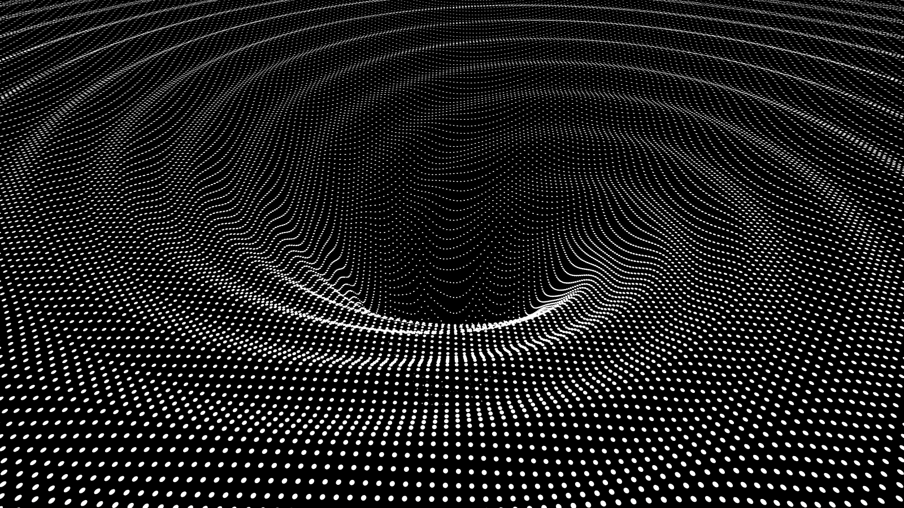

  

# 👋 Hey, I'm Juan De Dios  
_Amateur physicist & Engineering student (USACH)_  
Crafting **interactive simulations** to unravel the universe and sharing science with everyone — from kids to cosmic enthusiasts.

---

## 🚀 Tech Stack & Tools

---

## 🪐 Featured Projects

| Project | Tech | What's It About? |
|---------|------|------------------|
| **[🌌 DVT-GP-Ultra](https://github.com/CienciaEstelar/DVT-GP-Ultra)** | **Python Core** • NumPy • SciPy • SymPy • Matplotlib **Advanced** • scikit-learn • Optuna • ReportLab | **Dynamic Vacuum Toolkit (DVT) - GP Ultra Framework** Entrenamiento y validación de modelos de Proceso Gaussiano (GP) aplicados a Energía Oscura Dinámica. Incluye validaciones adversariales, simbólicas y reporte automático en PDF. |
| **[🧠 DVT-Toolkit](https://github.com/CienciaEstelar/DVT-toolkit)** | **Python** • NumPy • SciPy • MCMC • Matplotlib | Toolkit completo de inferencia cosmológica escalar-tensor. Integra derivación simbólica, integración numérica y análisis estadístico MCMC de modelos de Energía Oscura. |
| **[🔷 Geometría Causal-Informacional](https://github.com/CienciaEstelar/Geometria_Causal_Informacional)** | **LaTeX** • Python • SymPy | Marco teórico falsable que unifica gravedad cuántica, termodinámica e información. Implementa el concepto de **acción por ciclo** y derivación simbólica RG completa. |
| **[🔬 Vacuum Energy Toolkit](https://github.com/CienciaEstelar/vacuum-energy-calculator)**  | **Python Core** • NumPy • SciPy • Matplotlib | **Scientific-Grade QG Modeling (v22.0)** Computa ρ_vac & fuerza de Casimir con correcciones físicas. Genera 13 gráficos “publication-ready”. Validado con datos de Lamoreaux. |
| **🎮 MegaTetris Mejorado** | **Python** • Pygame • NumPy | **Tetris profesional en 500 líneas** • Sistema 7-Bag + Hold • Wall-kick simplificado • Arquitectura MVC limpia • [Código comentado en español](https://github.com/CienciaEstelar/Tetris/blob/main/MegaTetris.py) |
| **⚫ N-Body Black Hole Simulation** | Python, VPython | Visualización 3D en tiempo real de curvatura gravitacional alrededor de agujeros negros. |
| **🌌 Solar System Simulator** | Python, Matplotlib | Dinámica orbital de alta precisión con masas personalizables. |

---

## 🎓 Recent Certifications
- Google Cloud • _Multimodality & RAG_ (06/2024)  
- Google Cloud • _Prompt Design in Vertex AI_ (06/2024)  
- Microsoft Learn • _Copilot Studio & Azure AI Studio_ (05/2024)  
- Microsoft Learn • _Azure OpenAI Service / Generative AI_ (03/2024)  

---

## 🌠 Outreach & Mentorship
- **Mentor** at [Academia Into Space](https://academiaintospace.wixsite.com/academia-into-space) – Free astronomy courses for curious minds.  
- **Content Creator** on Instagram: [@cienciaestelar_cl](https://instagram.com/cienciaestelar_cl) – Inspiring +5,200 followers with cosmic content.  
- **TikTok** → [@cienciaestelar_cl](https://www.tiktok.com/@cienciaestelar_cl)

---

## 📊 GitHub Stats

  
  

  

---

## 🤝 Let's Collaborate!
Passionate about **physical simulations**, **scientific visualization**, or **STEM outreach**?  
Let’s build something stellar together 🌠  
👉 Drop an issue or hit me up on [Instagram](https://www.instagram.com/cienciaestelar_cl).
