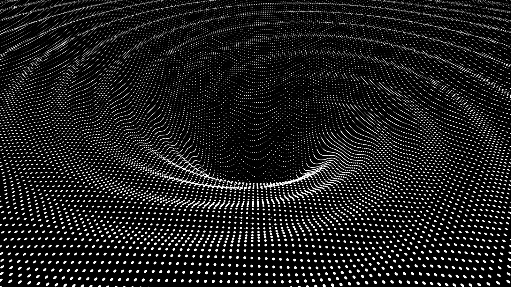

  

# 👋 Hola, soy Juan de Dios

*Investigador independiente · Ingenieria en Minas (USACH) · Santiago, Chile 🇨🇱*

Diseno **sistemas cuantitativos y simulaciones cientificas** para comprender sistemas complejos — desde mercados financieros hasta fisica del universo. Priorizo **evidencia sobre narrativa, robustez sobre complejidad, y observabilidad sobre inteligencia reactiva.**

  

---

## 🧭 Sobre mi

Trabajo en la interseccion entre **sistemas cuantitativos, fisica computacional e ingenieria**. Diseno sistemas completos, reproducibles y observables: ingesta de datos → validacion → ejecucion → monitoreo.

Areas activas:

* Propulsion interestelar (warp drives, velas laser, beam-riding)
* Sistemas cuantitativos adaptativos (crypto + equities)
* Gaussian Processes y machine learning con base fisica
* Simulaciones cosmologicas y modelos de energia oscura
* Soft-sensors industriales para mineria
* Divulgacion cientifica y educacion STEM

ORCID: `0009-0007-7474-7560` · Zenodo: [11 publicaciones](https://zenodo.org/search?q=metadata.creators.person_or_org.name:%22Galaz,%20Juan%22)

---

## 🚀 Stack

  

---

## 🏗️ Proyectos destacados

<table>
<tr>
<td width="50%">

### 🚀 [Propulsion Interestelar](https://github.com/CienciaEstelar/propulsion-interestelar)
Revision de 28 conceptos de propulsion interestelar con 146 referencias. **Score: 8.6/10.** Codigo Python reproducible. [DOI: 10.5281/zenodo.20435538](https://doi.org/10.5281/zenodo.20435538)

`Python` `LaTeX` `Jupyter`

</td>
<td width="50%">

### 🔬 [Beam-Riding Gap Analysis](https://github.com/CienciaEstelar/beam-riding-gap)
Brecha experimental en velas laser interestelares. Beam-riding **nunca observado**. 5 experimentos propuestos. **Score: 9.1/10.** [DOI: 10.5281/zenodo.20450485](https://doi.org/10.5281/zenodo.20450485)

`Python` `TMM` `RCWA`

</td>
</tr>
<tr>
<td width="50%">

### 📊 [BOS(5) Alpha Estructural](https://zenodo.org/records/20361451)
Validacion cuantitativa multi-activo con 90,000 simulaciones Monte Carlo. S&P 500 (98 anos), Bitcoin, altcoins. [DOI: 10.5281/zenodo.20361451](https://doi.org/10.5281/zenodo.20361451)

`Python` `Monte Carlo` `Bootstrap`

</td>
<td width="50%">

### 🌌 [Dark Forest MC](https://github.com/CienciaEstelar/dark-forest-mc)
Simulacion Monte Carlo de la hipotesis del Bosque Oscuro (Paradoja de Fermi). N-body con sensibilidad Sobol, analisis GHZ, paper MNRAS-ready. **Δr = −0.54 (27σ).**

`Python` `NumPy` `SALib` `cKDTree`

</td>
</tr>
<tr>
<td width="50%">

### 🧪 [bayesgp](https://github.com/CienciaEstelar/bayesgp)
Bayesian Model Averaging sobre portfolio de Gaussian Process regressors. 43 tests, CI/CD. [DOI: 10.5281/zenodo.20320144](https://doi.org/10.5281/zenodo.20320144)

`Python` `GP` `scikit-learn`

</td>
<td width="50%">

### ⛏️ [Proyecto Minero 4.0](https://github.com/CienciaEstelar/proyecto_minero_4.0)
Soft-sensor con Gaussian Processes para recuperacion en flotacion. **R² = 0.9695, MAPE = 1.46%.** Pipeline industrial con validacion externa.

`Python` `GP` `pandas` `Optuna`

</td>
</tr>
<tr>
<td width="50%">

### 🧠 [DVT-Toolkit](https://github.com/CienciaEstelar/DVT-toolkit)
Toolkit cosmologia escalar-tensor con derivacion simbolica, MCMC, y validacion estadistica. [DOI: 10.5281/zenodo.17291785](https://doi.org/10.5281/zenodo.17291785)

`Python` `MCMC` `NumPy`

</td>
<td width="50%">

### 🔷 [Geometria Causal-Informacional](https://github.com/CienciaEstelar/Geometria_Causal_Informacional)
Marco teorico falsable conectando gravedad, termodinamica e informacion. Derivacion RG completa.

`LaTeX` `Python` `SymPy`

</td>
</tr>
</table>

### Evolucion de proyectos legacy

| Proyecto original | Estado | Evolucion |
|---|---|---|
| `h como Evento Elemental` (2025) | Rechazado (overfitting) | → [`vacuumpy`](https://github.com/CienciaEstelar/vacuumpy) + [`vacio-cuantico`](https://github.com/CienciaEstelar/vacio-cuantico) |
| `vacuum_energy.py` (2025) | Superado | → [`vacuumpy`](https://github.com/CienciaEstelar/vacuumpy) (paquete limpio, mantenido) |
| `Espejo de Silicio` (2025) | Final | 185 descargas. Investigacion independiente en metacognicion IA. No requiere actualizacion. |

---

**[Ver perfil completo en Zenodo](https://zenodo.org/search?q=metadata.creators.person_or_org.name:%22Galaz,%20Juan%22)** (10 publicaciones con DOI).

| Fecha | Publicacion | DOI | Repo |
|---|---|---|---|
| 2026-05-29 | Dark Forest MC (MNRAS-ready) | [10.5281/zenodo.20451755](https://doi.org/10.5281/zenodo.20451755) | [dark-forest-mc](https://github.com/CienciaEstelar/dark-forest-mc) |
| 2026-05-29 | Beam-Riding Gap Analysis | [10.5281/zenodo.20450485](https://doi.org/10.5281/zenodo.20450485) | [beam-riding-gap](https://github.com/CienciaEstelar/beam-riding-gap) |
| 2026-05-28 | De Alcubierre a la Ingenieria | [10.5281/zenodo.20435538](https://doi.org/10.5281/zenodo.20435538) | [propulsion-interestelar](https://github.com/CienciaEstelar/propulsion-interestelar) |
| 2026-05-24 | BOS(5) Alpha Estructural | [10.5281/zenodo.20361451](https://doi.org/10.5281/zenodo.20361451) | --- |
| 2026-05-21 | bayesgp | [10.5281/zenodo.20320144](https://doi.org/10.5281/zenodo.20320144) | [bayesgp](https://github.com/CienciaEstelar/bayesgp) |
| 2026-05-21 | vacuumpy | [10.5281/zenodo.20320142](https://doi.org/10.5281/zenodo.20320142) | [vacuumpy](https://github.com/CienciaEstelar/vacuumpy) |

---

## 📊 Actividad

  
  

  

  <picture>
    <source media="(prefers-color-scheme: dark)" srcset="https://raw.githubusercontent.com/CienciaEstelar/CienciaEstelar/output/github-contribution-grid-snake-dark.svg">
    <source media="(prefers-color-scheme: light)" srcset="https://raw.githubusercontent.com/CienciaEstelar/CienciaEstelar/output/github-contribution-grid-snake.svg">
    
  </picture>

---

## 🌠 Divulgacion

* **Mentor** en Academia Into Space — educacion gratuita en astronomia
* **Divulgador** en Instagram y TikTok ([@cienciaestelar_cl](https://instagram.com/cienciaestelar_cl))
* Creador de contenido accesible para estudiantes, docentes y publico general

---

## 🤝 Colaboracion

¿Te interesa la **investigacion cuantitativa**, el **machine learning con base fisica**, los **sistemas industriales** o la **educacion STEM**?

Contacto: [GitHub](https://github.com/CienciaEstelar) · [Instagram](https://instagram.com/cienciaestelar_cl)

---

<i>"Ni tu ni yo tenemos la razon; la construimos conjuntamente mediante evidencia."</i>

